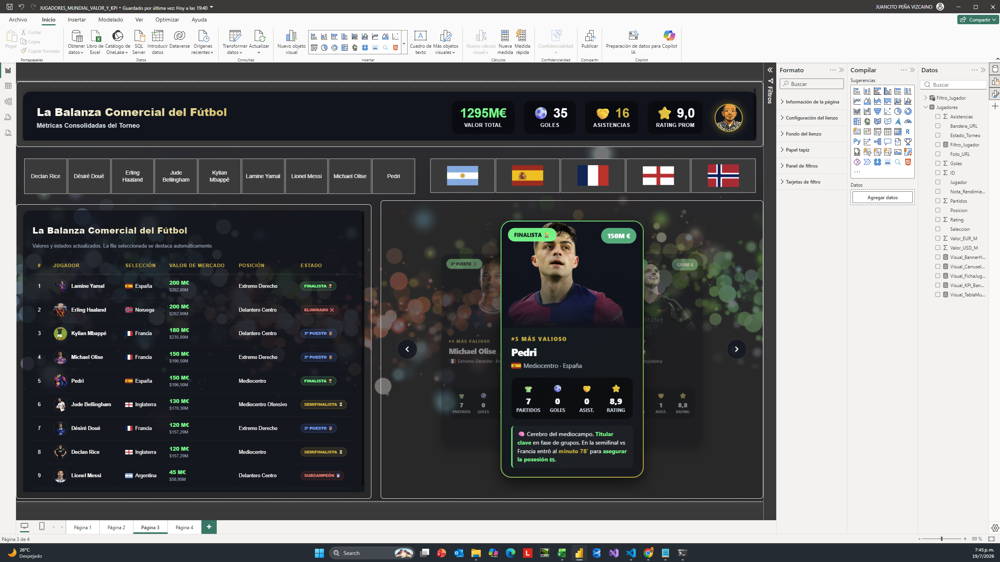

# ⚽ Jugadores Más Valiosos Mundial - Power BI & Storytelling

¡Bienvenidos al repositorio de **Jugadores Más Valiosos Mundial**! Este proyecto representa la nueva generación de visualización de datos en Power BI, donde el análisis tradicional evoluciona hacia una experiencia de **Storytelling** inmersiva. 

## 📖 La Nueva Era del Análisis de Datos: Narrativa e Inteligencia Artificial

Durante mucho tiempo, la visualización de datos se limitó a gráficos de barras, líneas y tablas frías. Sin embargo, hoy en día el juego ha cambiado. Con el surgimiento de herramientas avanzadas como el visual **HTML Content** para Power BI y el apoyo de la **Inteligencia Artificial**, ya no solo analizamos datos: **ahora contamos historias**. 

Crear un *storytelling* de alto nivel antes requería grandes inversiones en desarrollo web personalizado. Hoy, podemos integrar HTML, CSS y JavaScript dinámicamente mediante **DAX** directamente en Power BI. Esta fusión permite diseñar interfaces de usuario (UI) y experiencias (UX) que conectan de inmediato con el usuario final, generando un impacto visual profundo y entregando el mensaje correcto en el momento preciso.

## 🚀 Acerca de este Proyecto

Este dashboard interactivo expone el valor de mercado, el rendimiento y las estadísticas clave de los jugadores más valiosos a nivel mundial. Utiliza técnicas avanzadas para renderizar tarjetas de perfil enriquecidas, fusionando datos cuantitativos con componentes visuales (imágenes, banderas, tipografías personalizadas y estilos modernos).

### 🛠️ Características Principales

- **UX / UI de Alto Nivel:** Diseño de interfaz premium que capta la atención.
- **Tarjetas Dinámicas HTML/CSS:** Generación de contenido visual hiper-personalizado utilizando DAX.
- **KPIs de Rendimiento:** Métricas clave (Valor, Goles, Asistencias, Rating) centralizadas.
- **Narrativa de Datos:** No es solo un reporte, es una historia interactiva sobre la élite del fútbol mundial.

---

## 🗄️ Modelo de Datos y Arquitectura

### 📂 Base de Datos
El proyecto consume un modelo de datos estructurado en formato tabular, alimentado originalmente por el archivo `BD.xlsx`. 

**Tabla Principal:** `BD`
Esta tabla consolida toda la información demográfica y de rendimiento de los jugadores.
- **Campos Clave:**
  - `ID`: Identificador único del jugador.
  - `Jugador`: Nombre completo.
  - `Seleccion`: País o selección nacional que representa.
  - `Posicion`: Rol táctico en el campo.
  - `Valor_EUR_M` / `Valor_USD_M`: Valor de mercado en millones (Euros y Dólares).
  - `Estado_Torneo`: Estatus actual en competiciones (Activo, Eliminado, etc.).
  - `Partidos`, `Goles`, `Asistencias`: Estadísticas ofensivas y de participación.
  - `Rating` / `Nota_Rendimiento`: Calificación del desempeño basada en algoritmos/estadísticas.
  - `Foto_URL`: Enlace directo a la imagen del jugador.
  - `Bandera_URL`: Enlace al recurso gráfico de la bandera de su selección.

### 📊 Medidas DAX y HTML Content
El verdadero poder de este dashboard reside en las **Medidas Visuales (Visual Measures)**. 

A través del lenguaje DAX, se han construido medidas que no retornan un simple número, sino cadenas de texto que contienen **código HTML, CSS y JS dinámico**. El visual *HTML Content* interpreta este código en tiempo real, permitiendo:

1. **Inyección de Estilos (CSS):** Bordes redondeados, sombras, gradientes, paletas de colores basadas en el estado del jugador y animaciones `hover`.
2. **Estructura Dinámica (HTML):** Maquetación de tarjetas (Cards) usando Flexbox o Grid, combinando las URLs de las fotos (`Foto_URL`) y banderas (`Bandera_URL`) junto con los KPIs.
3. **Lógica Condicional DAX:** El diseño se adapta según los datos. Por ejemplo, el color de la tarjeta puede cambiar dependiendo del `Rating` del jugador o su `Estado_Torneo`.

**Ejemplo del Flujo:**
`Datos en Tabla -> Fórmula DAX concatena HTML/CSS + Valores Dinámicos -> Visual HTML Content renderiza la Tarjeta Premium`

---

## 💡 Cómo Visualizar este Proyecto

1. **Requisitos:** Tener instalado [Power BI Desktop](https://powerbi.microsoft.com/desktop/).
2. **Descarga:** Clona este repositorio o descarga los archivos.
3. **Apertura:** Abre el archivo `JUGADORES_MUNDIAL_VALOR_Y_KPI.pbix`.
4. **Visual HTML Content:** Asegúrate de que el visual personalizado "HTML Content" (provisto en el modelo) esté habilitado.
5. **Explora:** Interactúa con los filtros y descubre la historia detrás de los datos.

---

## 👨‍💻 Reflexión Final

La integración de **IA** en la redacción de código DAX complejo, sumado al poder del renderizado web dentro de herramientas de BI, ha democratizado el diseño de interfaces de élite. Este proyecto es una muestra de cómo los analistas de datos modernos deben pensar también como diseñadores de experiencias, garantizando que los datos no solo sean precisos, sino que tengan **voz y presencia visual**.

---
*Creado con pasión por el análisis de datos, el diseño de interfaces y la innovación tecnológica.*
